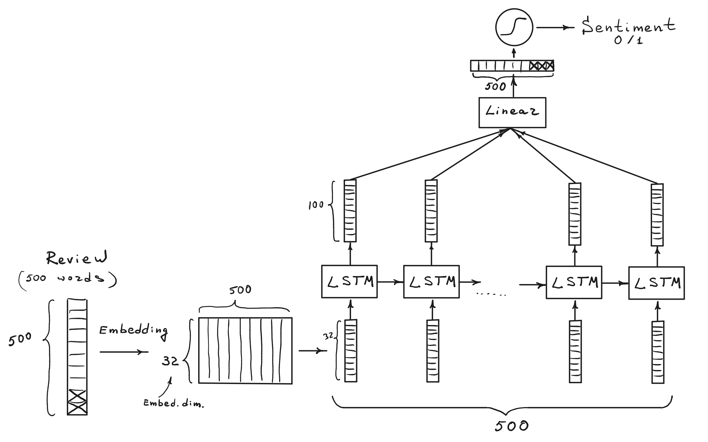
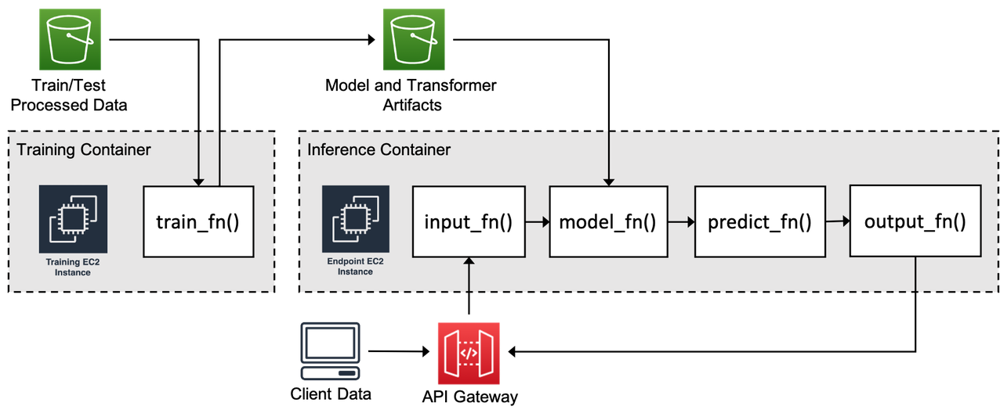
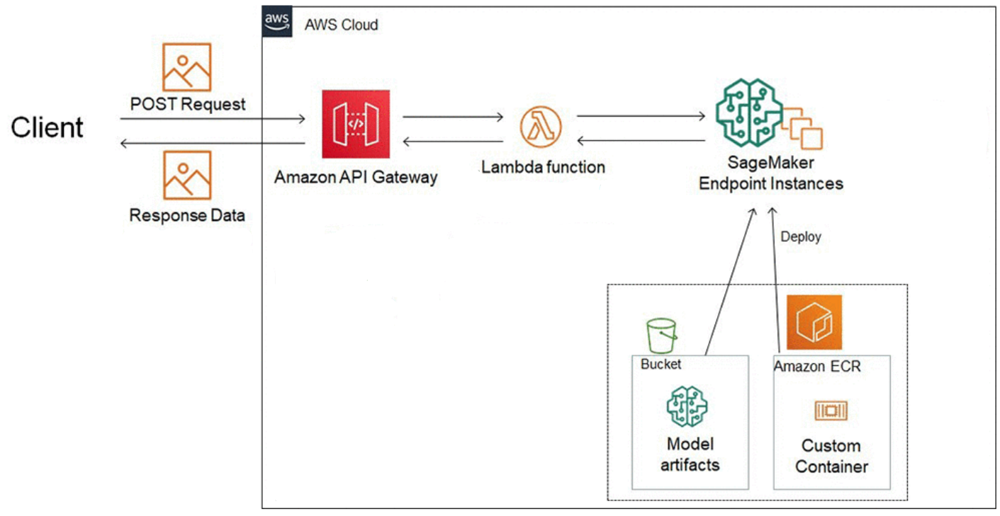
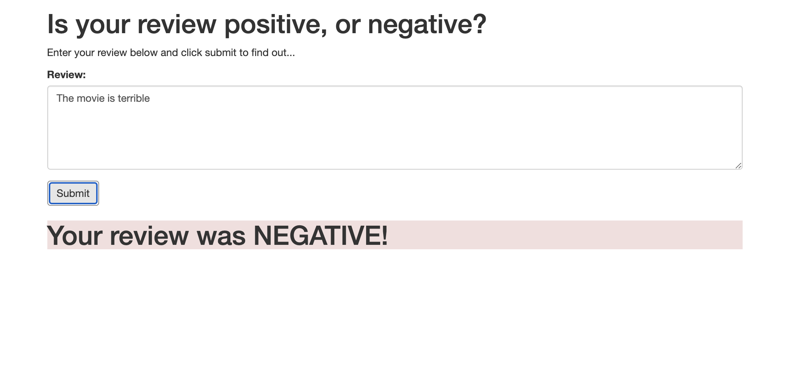
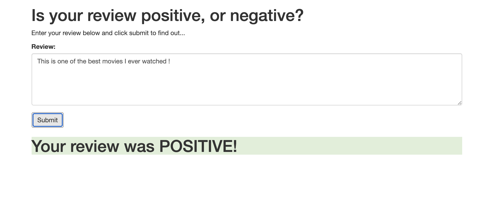

# RNN sentiment analysis model training and deployment using AWS SageMaker

This repository contains code for training and deployment of a simple LSTM-based neural network using Amazon Sagemaker. We use a simple web app to interact with the deployed model.
The recurrent neural network is trained to identify the sentiment of a movie review using the [IMDB data set](http://ai.stanford.edu/~amaas/data/sentiment/).

> Maas, Andrew L., et al. Learning Word Vectors for Sentiment Analysis. In Proceedings of the 49th Annual Meeting of the Association for Computational Linguistics: Human Language Technologies. Association for Computational Linguistics, 2011.

## LSTM-based neural network for sentiment analysis

To test the ML training and deployment workflow using Amazon SageMaker we use a single LSTM layer, see `model-deployment.ipynb`.

The text is preprocessed using:

- `BeautufulSoup` to remove HTML tags
- `NLTK` to remove stop words and perform stemming

## Deploying PyTorch model in SageMaker

Deployment steps:

- Upload preprocessed training data to S3
- Build the training container in SageMaker; use the python script `train/train.py` to communicate with the pytorch model
- Train the model within the SageMaker training container
- The trained model artefacts are saved in S3 bucket
- Build the inference container (with the custom inference code, see next paragraph) for web app deployment 
- Deploy the model
- Set up a Lambda function
- Set up an API Gateway 

When deploying a PyTorch model in SageMaker, four functions should be provided for the SageMaker inference container (see `serve/predict.py`):

- `input_fn`: This function receives the raw serialized input that has been sent to the model's endpoint and its job is to de-serialize and make the input available for the inference code.
- `model_fn`: Load the trained model artifacts from Amazon S3.
- `predict_fn`: Make predictions, this is the heart of the inference script.
- `output_fn`: This function takes the output of the inference code and its job is to serialize this output and return it to the caller of the model's endpoint.

For the simple website that we are constructing during this project, the `input_fn` and `output_fn` methods are relatively straightforward. We only require being able to accept a string as input and we expect to return a single value as output.

## Using the model for the web app

The goal of this exersise is to use a web app to access the trained pytorch LSTM model. In order to access the SageMaker endpoint the app would need to authenticate with AWS using an Identity and Access Management (IAM) role which includes access to SageMaker endpoints, however an easier way is to use a Lambda function. We will grant this function permission to send and receive data from a SageMaker endpoint.

API Gateway is a new endpoint that is used to execute the Lambda function. This endpoint is a URL that listens for data to be sent to it. Once it gets some data it will pass that data on to the Lambda function and then return whatever the Lambda function returns. Essentially it will act as an interface that lets our web app communicate with the Lambda function.

## Deploying the web app

The sentiment prediction web app can be tested using `index.html`, inside the file one should specify the public API URL that is obtaied when setting up the AWS API Gateway.

Two example outputs of the web app run are given below.

<kbd></kbd>

<kbd></kbd>